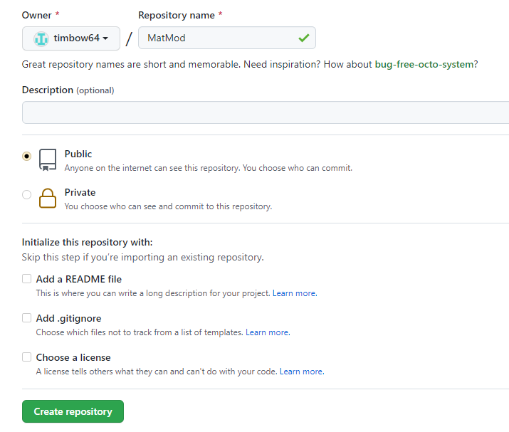
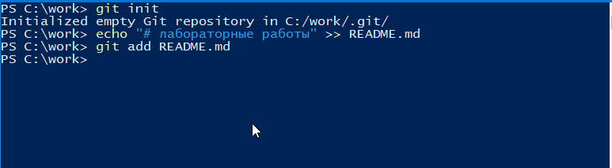
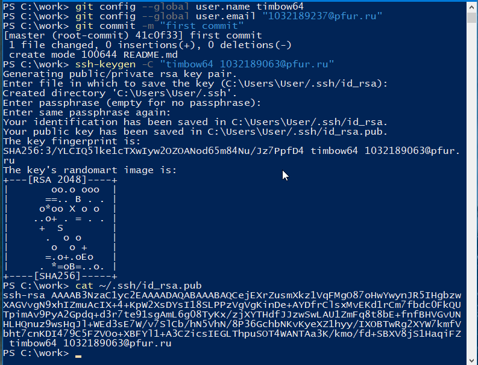
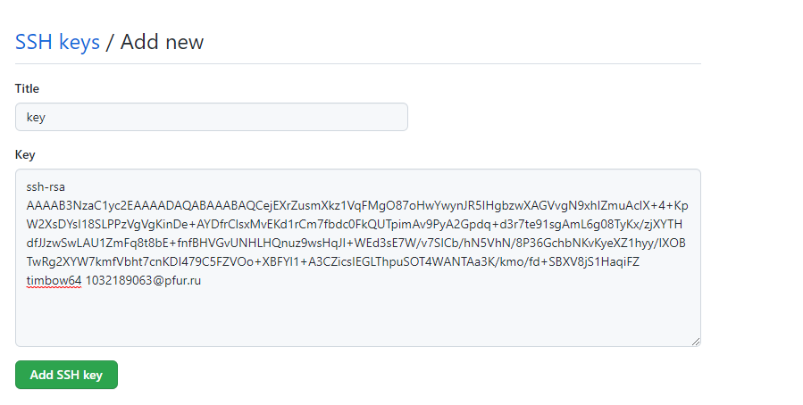
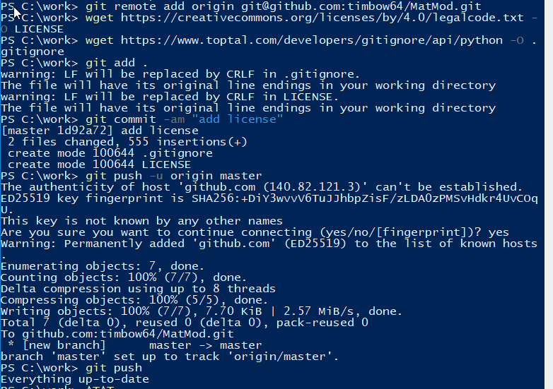
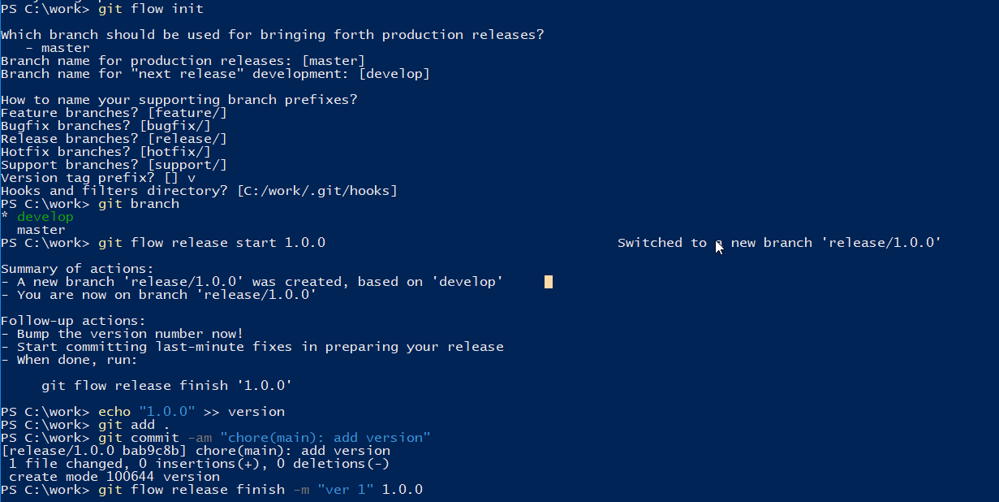
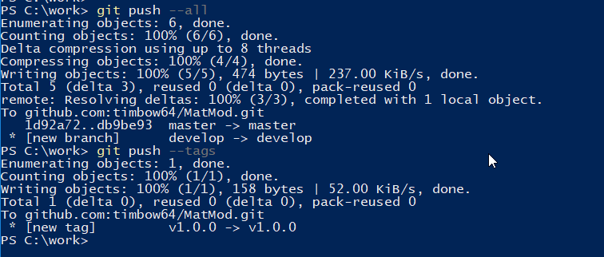
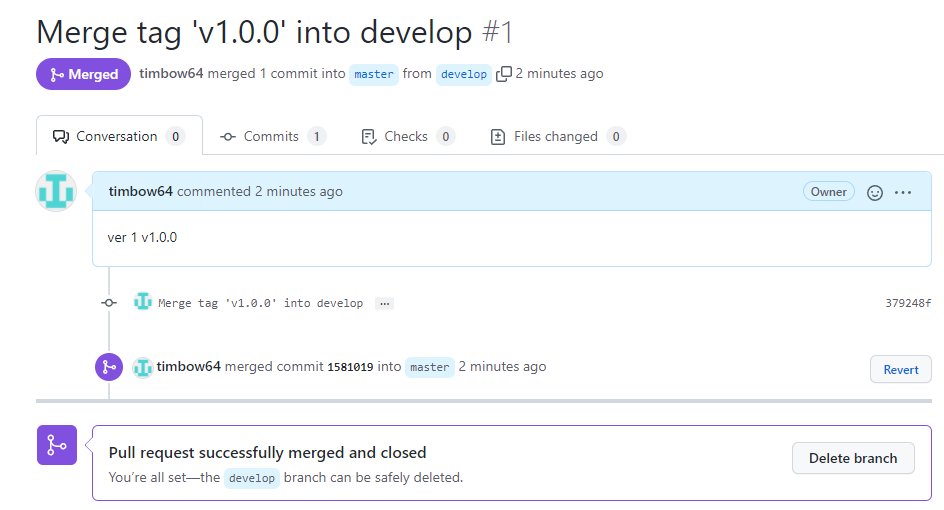

---
## Front matter
lang: ru-RU
title: Лабораторная работа № 1 по дисциплине Математическое моделирование.
author: Миша Нкого Хосе Адольфо Мба	НФИбд-02-19
institute: Российский Университет Дружбы Народов
date: 10 февраля, 2022, Москва, Россия

## Formatting
mainfont: PT Serif
romanfont: PT Serif
sansfont: PT Sans
monofont: PT Mono
toc: false
slide_level: 2
theme: metropolis
header-includes: 
 - \metroset{progressbar=frametitle,sectionpage=progressbar,numbering=fraction}
 - '\makeatletter'
 - '\beamer@ignorenonframefalse'
 - '\makeatother'
aspectratio: 43
section-titles: true

---

# Цели и задачи работы

## Цель лабораторной работы

Целью данной работы мы ставим изучение и применения средств контроля версий git, а также работу с различными командами в консоли.

## Задачи лабораторной работы

1. Создать учетную запись на github.com

2. Создать и настроить репозиторий

3. Изучить механизм управления версиями

4. Изучить команды для работы с ветками

# Ход выполнения работы

## Создаем учетную запись и репозиторий

{ #fig:001 width=70% height=70% }

## Инициализируем данный локальный репозиторий

{ #fig:002 width=70% height=70% }

## Создаем SSH-ключ. Прописываем его в настройках на сайте.

{ #fig:003 width=70% height=70% }

## Добавление ключа на github.com 

{ #fig:004 width=70% height=70% }

## Загружаем и отправляем файлы лицензионного соглашения и gitignore в сетевой репозиторий.

{ #fig:005 width=70% height=70% }

## Изучаем систему управления версиями файлов. Создаем ветку, начинаем и завершаем в ней релиз.

{ #fig:006 width=70% height=70% }

## Использование системы управления версиями

{ #fig:008 width=70% height=70% }

## Выполним объединение веток

{ #fig:009 width=70% height=70% }

# Выводы по проделанной работе

## Вывод

Мы изучили и применили средства контроля версий git, а также научились работать с различными командами в консоли.