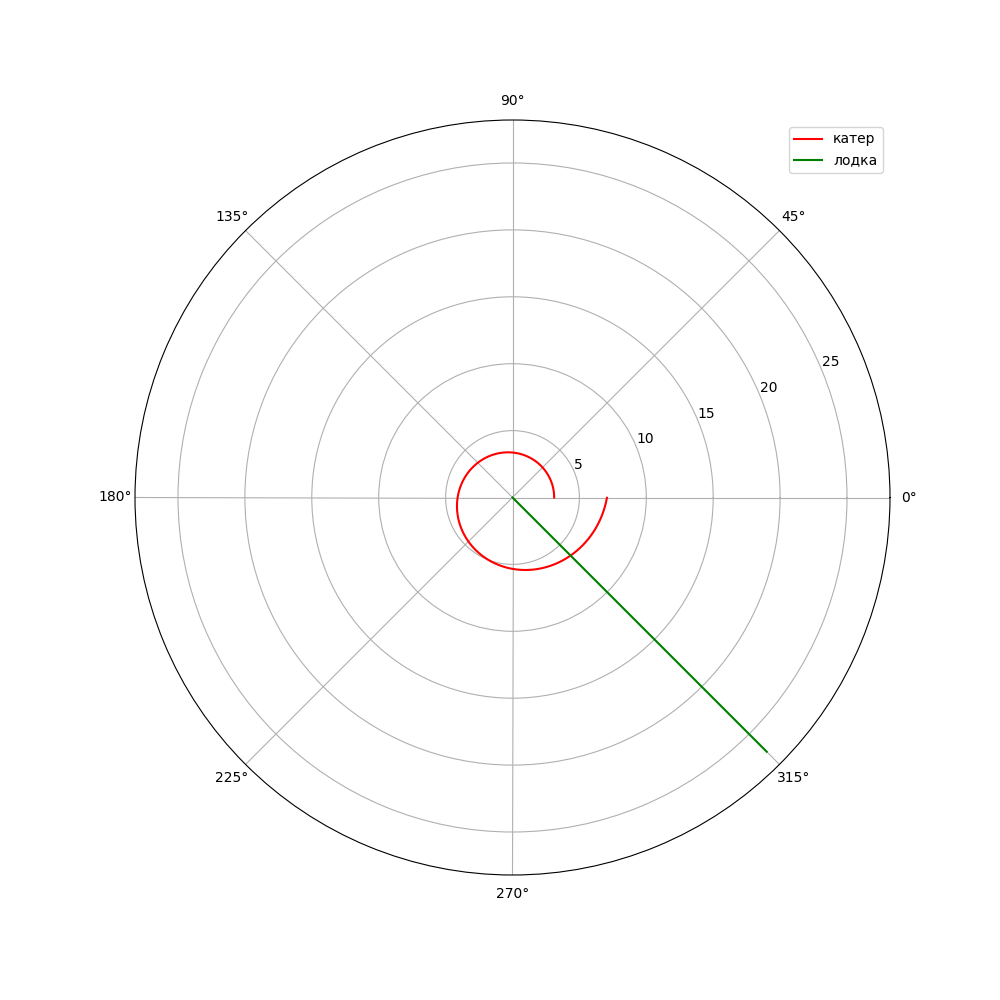
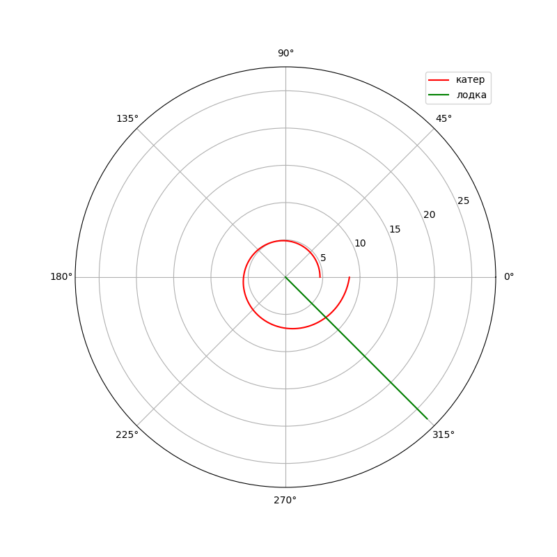

---
## Front matter
lang: ru-RU
title: Лабораторная №2 - Задача о погоне
author: |
	 Миша Нкого Хосе Адольфо Мба НФИбд-02-19\inst{1}

institute: |
	\inst{1}Российский Университет Дружбы Народов

date: 14 февраля, 2022, Москва, Россия

## Formatting
mainfont: PT Serif
romanfont: PT Serif
sansfont: PT Sans
monofont: PT Mono
toc: false
slide_level: 2
theme: metropolis
header-includes: 
 - \metroset{progressbar=frametitle,sectionpage=progressbar,numbering=fraction}
 - '\makeatletter'
 - '\beamer@ignorenonframefalse'
 - '\makeatother'
aspectratio: 43
section-titles: true

---

# Цели и задачи работы

## Цель работы:

Сегодня мы разберем один из случаев построения математической модели, в случае когда нам нужно выбрать правильную стратегию для решения задач поиска. 
Для примера мне был выдан вариант, где я должен рассмотреть задачу преследования браконьеров береговой охраной. Ее условия: "На море в тумане катер береговой охраны преследует лодку браконьеров. Через определенный промежуток времени туман рассеивается, и лодка обнаруживается на расстоянии k км от катера. Затем лодка снова скрывается в тумане и уходит прямолинейно в неизвестном направлении. Известно, что скорость катера в n раза больше скорости браконьерской лодки. 
Необходимо определить по какой траектории необходимо двигаться катеру, чтоб нагнать лодку." 

# Задача:

1. Изучить условия задачи. Сделать рассуждения на тему решения задачи
2. Вывести дифференциальное уравнение, беря в расчет условие, что скорость катера больше скорости лодки в n раз ( или меньше ) .
2. Рассчитать и построить траекторию движения катера и лодки для двух случаев. 
3. Определить по графику точку пересечения катера и лодки.

# Процесс выполнения лабораторной работы

## Теоретический материал 

* Принимаем за $t_0=0, X_0=0$  - место нахождения лодки браконьеров в момент, когда их обнаруживают катера береговой охраны. После введем полярные координаты.

* Время, за которое они пройдут это расстояние, вычисляется как $\frac{x}{υ}$ или $\frac{x+k}{υ}$ (для второго случая $\frac{x-k}{υ}$).  Так как время одно и то же, то эти величины одинаковы. 

* Тогда неизвестное расстояние можно найти из следующего уравнения:  $\frac{x}{υ} = \frac{x+k}{υ}$ - в первом случае, $\frac{x}{υ} =  \frac{x-k}{υ}$ во втором случае.

## Теоретический материал 

* Отсюда мы найдем два значения $x_1$ и $x_2$, задачу будем решать для двух случаев : 

$x_1=\frac{k}{n+1}$ ,при $\theta=0$

$x_2=\frac{k}{n-1}$ ,при $\theta=-\pi$

## Теоретический материал 

* Найдем тангенциальную скорость для нашей задачи $υ_t=r\frac{d\theta}{dt}$.
* Вектора образуют прямоугольный треугольник, откуда по теореме Пифагора можно найти тангенциальную скорость $υ_t= \sqrt{n^2 υ_r^2-v^2}$. Поскольку, радиальная скорость равна $υ$, то тангенциальную скорость находим из уравнения $υ_t= \sqrt{n^2 υ^2-υ^2 }$. Следовательно, $υ_τ=υ\sqrt{n^2-1}$.

* Тогда получаем $r\frac{d\theta}{dt}=υ\sqrt{n^2-1}$

## Теоретический материал 

* Решение исходной задачи сводится к решению системы из двух дифференциальных уравнений 

$$
 \begin{cases}
   \frac{dr}{dt}=υ
	\\   
	r\frac{d\theta}{dt}=υ\sqrt{n^2-1}
 \end{cases}
$$

* с начальными условиями

$$
 \begin{cases}
   \theta_0=0
   \\
	r_0=\frac{k}{n+1}
 \end{cases}
\
$$

$$
 \begin{cases}
   \theta_0=-\pi
   \\
	r_0=\frac{k}{n-1}
 \end{cases}
\
$$

## Теоретический материал 

* Исключая из полученной системы производную по t, можно перейти к следующему уравнению: $\frac{dr}{d\theta}=\frac{r}{\sqrt{n^2-1}}$

* Начальные условия остаются прежними. Решив это уравнение, мы получим траекторию движения катера в полярных координатах. 

## Условие задачи:

> На море в тумане катер береговой охраны преследует лодку браконьеров.
Через определенный промежуток времени туман рассеивается, и лодка обнаруживается на расстоянии 19 км от катера. 
Затем лодка снова скрывается в тумане и уходит прямолинейно в неизвестном направлении. 
Известно, что скорость катера в 5.1 раза больше скорости браконьерской лодки

## Результаты## Результаты работы программы

{ #fig:001 width=50% height=50% }

Точка пересечения красного и зеленого графиков является точкой пересечения катера береговой охраны и лодки браконьеров. Исходя из этого графика, мы имеем координаты: 
$$
 \begin{cases}
   \theta=315
   \\
	r=6.139
 \end{cases}
\
$$

## Результаты

{ #fig:002 width=50% height=50% }

Точка пересечения красного и зеленого графиков является точкой пересечения катера береговой охраны и лодки браконьеров. Исходя из этого графика, мы имеем координаты: 
$$
 \begin{cases}
   \theta=315
   \\
	r=7.658
 \end{cases}
\
$$

# Выводы по проделанной работе

Мы рассмотрели задачу о погоне, также провели анализ с помощью данных которые нам были даны, составили и решили дифференциальные уравнения. Смоделировали ситуацию и сделали вывод из модели ситуации.
Из модели мы выяснили, что при погоне «по часовой стрелке» для достижения цели потребуется пройти значительно меньшее расстояние.

