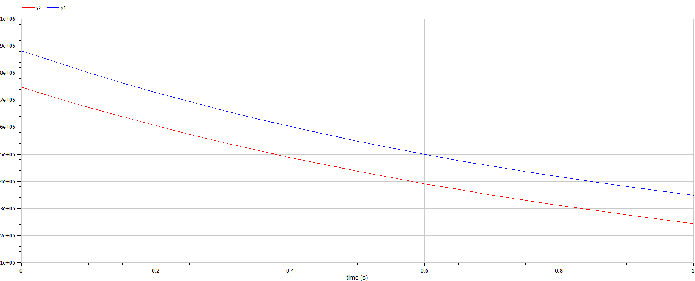
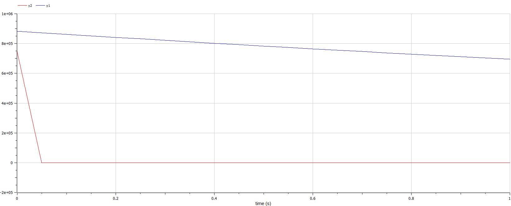

---
## Front matter
lang: ru-RU
title: Лабораторная работа №3 - "Модель боевых действий"
author: |
	 Миша Нкого Хосе Адольфо Мба НФИбд-02-19\inst{1}

institute: |
	\inst{1}Российский Университет Дружбы Народов

date: 22 февраля, 2022, Москва, Россия

## Formatting
mainfont: PT Serif
romanfont: PT Serif
sansfont: PT Sans
monofont: PT Mono
toc: false
slide_level: 2
theme: metropolis
header-includes: 
 - \metroset{progressbar=frametitle,sectionpage=progressbar,numbering=fraction}
 - '\makeatletter'
 - '\beamer@ignorenonframefalse'
 - '\makeatother'
aspectratio: 43
section-titles: true

---

# Цели и задачи работы

## Цель лабораторной работы

Целью работы является рассмотрение некоторых простейший моделей боевый действий, а именно модели Ланчестера. В борьбе могут принимать участия регулярные и партизанские отряды. В таком случае главной характеристикой будет учитываться численность войск. Если численность войск станет равной нулу, то данная сторона будет являться проигравшей ( при условии, что у другой стороны остались войска). 

## Задание к лабораторной работе

1. Изучение трех случае модели Ланчестера
2. Теоритический вывод уравнений для построения графика
3. Построение графиков изменения численности войск 
4. Определение стороны победившей в ходе битвы

# Процесс выполнения лабораторной работы

## Теоретический материал 

Рассмотри три случая ведения боевых действий с учетом различных типов войск: 

1. Боевые действия между регулярными войсками
2. Боевые действия с участием регулярных войск и партизанских отрядов
3. Боевые действия между партизанскими отрядами 

## Теоретический материал Модель боевых действий между регулярными войсками и партизанскими отрядами:
В результате модель принимает вид:
$$
 \begin{cases}
	\frac{dx}{dt}= -a(t)x(t) - b(t)y(t) + P(t)
	\\   
	\frac{dy}{dt}= -c(t)x(t) - h(t)y(t) + Q(t)
 \end{cases}
$$

## Теоретический материал  Модель боевых действий между партизанскими отрядами:

Модель ведение боевых действий между партизанскими отрядами с учетом предположений, сделанном в предыдущем случаем, имеет вид:

$$
 \begin{cases}
	\frac{dx}{dt}= -a(t)x(t) - b(t)y(t) + P(t)
	\\   
	\frac{dy}{dt}= -c(t)x(t)y(t) - h(t)y(t) + Q(t)
 \end{cases}
$$

## Теоретический материал Модель ведение боевых действий между партизанскими отрядами с учетом предположений, сделанных в предыдущем случаем, имеет вид:

$$
 \begin{cases}
	\frac{dx}{dt}= -a(t)x(t) - b(t)x(t)y(t) + P(t)
	\\   
	\frac{dy}{dt}= -h(t)y(t) - c(t)x(t)y(t) + Q(t)
 \end{cases}
$$

## Условие задачи:

	Между страной $X$ и страной $Y$ идет война. Численность состава войск исчисляется от начала войны, и являются временными функциями $x(t)$ и $y(t)$
В начальный момент времени страна $X$ имеет армию численностью 882000 человек, а в распоряжении страны $Y$ армия численностью в 747000 человек.
Для упрощения модели считаем, что коэффициенты $a, b, c, h$ постоянны. 
Также считаем $P(t), Q(t)$ непрерывные функции.
Постройте графики изменения численности войск армии $X$ и армии $Y$ для следующих случаев:

## №1. Модель боевых действий между регулярными войсками

$$
 \begin{cases}
	\frac{dx}{dt}= -0.4x(t) - 0.67y(t) + sin(3t) + 1
	\\   
	\frac{dy}{dt}= -0.77x(t) - 0.14y(t) + cos(2t) + 2
 \end{cases}
$$

{ #fig:003 width=60% height=60% }

## №2. Модель боевых действий между регулярными войсками

$$
 \begin{cases}
	\frac{dx}{dt}= -0.24x(t) - 0.67y(t) + |sin(2t)|
	\\   
	\frac{dy}{dt}= -0.47x(t)y(t) - 0.14y(t) + |cos(2t)|
 \end{cases}
$$

{ #fig:004 width=60% height=60% }

# Выводы по проделанной работе

## Вывод

В результате проделанной лабораторной работы мы познакомились с моделью «Войны и сражения». 
Изучили и проверили, как работает модель в различных ситуациях и трех случаях численности и состава войск. Построили графики $y(t)$ и $x(t)$ в рассматриваемых случаях.