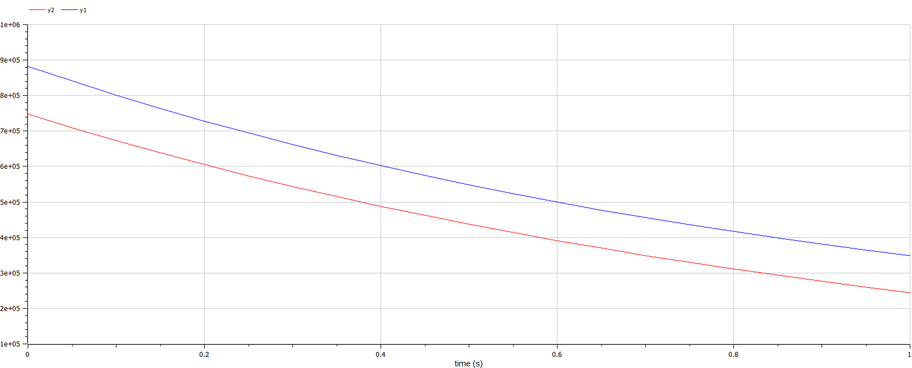
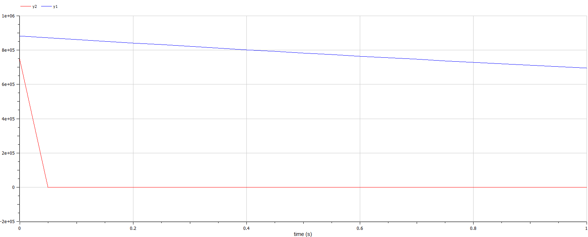

---
# Front matter
lang: ru-RU
title: "Отчет по лабораторной работе №3"
subtitle: "Модель боевых действий - вариант 38"
author: "Миша Нкого Хосе Адольфо Мба НФИбд-02-19"

# Formatting
toc-title: "Содержание"
toc: true # Table of contents
toc_depth: 2
lof: true # List of figures
fontsize: 12pt
linestretch: 1.5
papersize: a4paper
documentclass: scrreprt
polyglossia-lang: russian
polyglossia-otherlangs: english
mainfont: PT Serif
romanfont: PT Serif
sansfont: PT Sans
monofont: PT Mono
mainfontoptions: Ligatures=TeX
romanfontoptions: Ligatures=TeX
sansfontoptions: Ligatures=TeX,Scale=MatchLowercase
monofontoptions: Scale=MatchLowercase
indent: true
pdf-engine: lualatex
header-includes:
  - \linepenalty=10 # the penalty added to the badness of each line within a paragraph (no associated penalty node) Increasing the υalue makes tex try to haυe fewer lines in the paragraph.
  - \interlinepenalty=0 # υalue of the penalty (node) added after each line of a paragraph.
  - \hyphenpenalty=50 # the penalty for line breaking at an automatically inserted hyphen
  - \exhyphenpenalty=50 # the penalty for line breaking at an explicit hyphen
  - \binoppenalty=700 # the penalty for breaking a line at a binary operator
  - \relpenalty=500 # the penalty for breaking a line at a relation
  - \clubpenalty=150 # extra penalty for breaking after first line of a paragraph
  - \widowpenalty=150 # extra penalty for breaking before last line of a paragraph
  - \displaywidowpenalty=50 # extra penalty for breaking before last line before a display math
  - \brokenpenalty=100 # extra penalty for page breaking after a hyphenated line
  - \predisplaypenalty=10000 # penalty for breaking before a display
  - \postdisplaypenalty=0 # penalty for breaking after a display
  - \floatingpenalty = 20000 # penalty for splitting an insertion (can only be split footnote in standard LaTeX)
  - \raggedbottom # or \flushbottom
  - \usepackage{float} # keep figures where there are in the text
  - \floatplacement{figure}{H} # keep figures where there are in the text
---

# Цель работы
 
Целью работы является рассмотрение некоторых простейший моделей боевый действий, а именно модели Ланчестера. В борьбе могут принимать участия регулярные и партизанские отряды. В таком случае главной характеристикой будет учитываться численность войск. Если численность войск станет равной нулу, то данная сторона будет являться проигравшей ( при условии, что у другой стороны остались войска) . 

# Задание

1. Изучение трех случае модели Ланчестера
2. Теоритический вывод уравнений для построения графика
3. Построение графиков изменения численности войск 
4. Определение стороны победившей в ходе битвы

# Выполнение лабораторной работы

## Теоретические сведения

Рассмотри три случая ведения боевых действий с учетом различных типов войск: 
1. Боевые действия между регулярными войсками 
2. Боевые действия с участием регулярных войск и партизанских отрядов 
3. Боевые действия между партизанскими отрядами 

В первом случае ( сражение между регулярными войсками) численность войск определяется тремя факторами:

1. скорость уменьшения численности войск из-за причин, не связанных с боевыми действиями (болезни, травмы, дезертирство);
2. скорость потерь, обусловленных боевыми действиями противоборствующих сторон (что связанно с качеством стратегии, уровнем вооружения, профессионализмом солдат и т.п.);
3. скорость поступления подкрепления (задаётся некоторой функцией от времени). 


## Модель боевых действий между регулярными войсками:

В случае модели боевых действий между регулярными войсками описывается следующим образом:

$$
 \begin{cases}
	\frac{dx}{dt}= -a(t)x(t) - b(t)y(t) + P(t)
	\\   
	\frac{dy}{dt}= -c(t)x(t) - h(t)y(t) + Q(t)
 \end{cases}
$$

## Теоретические сведения

*Потери, которын не связанны с боевыми действиями, описывают члены $–a(t)x(t)$ и $–h(t)y(t)$, члены $–b(t)y(t)$ и $–c(t)x(t)$ отражают потери на поле боя. 
Коэффициенты $b(t)$, $c(t)$ указывают на эффективность боевых действий со стороны $y$ и $x$ соответственно, $a(t)$,$h(t)$  - величины, характеризующие степень влияния различных факторов на потери. 
Функции $P(t)$,$Q(t)$  учитывают возможность подхода подкрепления к войскам $X$ и $Y$ в течение одного дня. 

*В случае сражения между регулярными войсками и партизанскими отряды. Партизанские отряды в сравнение с регулярными менее уязвимы, так как действуют скрытно
В таком случае, сопернику прийдется действовать неизбирательно, по площадям, занимаемым партизанами. 
Поэтому можно сделать вывод, что темп потерь партизан, проводящих свои операции в разных местах на некоторой известной территории, вдобавок пропорционален численности самих партизан. 

## Модель боевых действий между регулярными войсками и партизанскими отрядами:

В результате модель принимает вид:

$$
 \begin{cases}
	\frac{dx}{dt}= -a(t)x(t) - b(t)y(t) + P(t)
	\\   
	\frac{dy}{dt}= -c(t)x(t)y(t) - h(t)y(t) + Q(t)
 \end{cases}
$$

## Модель боевых действий между партизанскими отрядами:

Модель ведение боевых действий между партизанскими отрядами с учетом предположений, сделанном в предыдущем случаем, имеет вид:

$$
 \begin{cases}
	\frac{dx}{dt}= -a(t)x(t) - b(t)x(t)y(t) + P(t)
	\\   
	\frac{dy}{dt}= -h(t)y(t) - c(t)x(t)y(t) + Q(t)
 \end{cases}
$$

## Модель простейший боевых действий:

*В простейшей модели борьбы двух противников коэффициенты $b(t)$ и $c(t)$ являются постоянными. 
Попросту говоря, предполагается, что каждый солдат армии $x$ убивает за единицу времени $c$ солдат армии $y$, также это работает и в обратную сторону.
Также не учитываются потери, не связанные с боевыми действиями, и возможность подхода подкрепления. 
Состояние системы описывается точкой $(x,y)$ положительного квадранта плоскости. Координаты этой точки, $x$ и $y$ - это численности противостоящих армий. Тогда модель принимает вид

$$
 \begin{cases}
	\frac{dx}{dt}= -by
	\\   
	\frac{dy}{dt}= -ax
 \end{cases}
$$

## Это - жесткая модель, которая допускает точное решение

$\frac{dx}{dy}=\frac{by}{cx}$

$cxdx=bydy, cx^2 - by^2 = C$

Эволюция численностей армий x и y происходит вдоль гиперболы, заданной этим уравнением (рис. -@fig:001). По какой именно гиперболе пойдет война, зависит от начальной точки.

{ #fig:001 width=70% height=70% }

## Вывод из модели:

Для борьбы с вдвое более многочисленным противником нужно в четыре раза более мощное оружие, с втрое более многочисленным - в девять раз и т. д. (на это указывают квадратные корни в уравнении прямой). 
Стоит помнить, что эта модель сильно идеализирована и неприменима к реальной ситуации. Но может использоваться для начального анализа. 

## Рассотрим второй случай:

война между регулярными войсками и партизанскими отрядами с теми же упрощениями, то модель принимает вид:

$$
 \begin{cases}
	\frac{dx}{dt}= -by(t)
	\\   
	\frac{dy}{dt}= -cx(t)y(t)
 \end{cases}
$$

Эта система приводит нас к уравнению $\frac{d}{dt}= (\frac{b}{2}x^2(t)-cy(t))=0$
которое, при заданных начальных условиях, имеет одно единственное решение:
$\frac{b}{2}x^2(t)-cy(t)=\frac{b}{2}x^2(0)-cy(0)=C_1$

## Фазовые траектории для второго случая

{ #fig:002 width=70% height=70% }

Из Рисунка @fig:002 видно, что при $C_1>0$ побеждает регулярная армия, при $C_1<0$ побеждают партизаны. Аналогично противоборству регулярных войск, победа обеспечивается не только начальной численностью, но и боевой выручкой и качеством вооружения. При $C_1>0$  получаем соотношение  $\frac{b}{2}x^2(0)>cy(0)$ Чтобы одержать победу партизанам необходимо увеличить коэффициент $c$ и повысить свою начальную численность на соответствующую величину. Причем это увеличение, с ростом начальной численности регулярных войск $x(0)$ должно расти не линейно, а пропорционально второй степени $x(0)$ . Таким образом, можно сделать вывод, что регулярные войска находятся в более выгодном положении, так как неравенство для них выполняется прим меньшем росте начальной численности войск.
Рассмотренные простейшие модели соперничества соответствуют системам обыкновенных дифференциальных уравнений второго порядка, широко распространенным при описании многих естественно научных объектов.


## Задача

Условие: Между страной $X$ и страной $Y$ идет война. Численность состава войск исчисляется от начала войны, и являются временными функциями $x(t)$ и $y(t)$
В начальный момент времени страна $X$ имеет армию численностью 882000 человек, а в распоряжении страны $Y$ армия численностью в 747000 человек.
Для упрощения модели считаем, что коэффициенты $a, b, c, h$ постоянны. 
Также считаем $P(t), Q(t)$ непрерывные функции.
Постройте графики изменения численности войск армии $X$ и армии $Y$ для следующих случаев:

## №1. Модель боевых действий между регулярными войсками

$$
 \begin{cases}
	\frac{dx}{dt}= -0.4x(t) - 0.67y(t) + sin(3t) + 1
	\\   
	\frac{dy}{dt}= -0.77x(t) - 0.14y(t) + cos(2t) + 2
 \end{cases}
$$

{ #fig:003 width=70% height=70% }

Победа достается армии $X$.

## №2. Модель ведение боевых действий с участием регулярных войск и партизанских отрядов

$$
 \begin{cases}
	\frac{dx}{dt}= -0.24x(t) - 0.67y(t) + |sin(2t)|
	\\   
	\frac{dy}{dt}= -0.47x(t)y(t) - 0.14y(t) + |cos(2t)|
 \end{cases}
$$

{ #fig:004 width=70% height=70% }

Победа достается армии $X$.

## Код программы

```
model Project
  parameter  Real a(start=0.4);
  parameter  Real b(start=0.67);
  parameter  Real c(start=0.77);
  parameter  Real h(start=0.14); 
  Real y1(start=882000);
  Real y2(start=747000);
  
  equation
    der(y1)= -a*y1-b*y2 + sin(3*time)+1;
    der(y2)= -c*y1-h*y2 + cos(2*time)+2;

  
  annotation(experiment(StartTime=0, StopTime=1, Tplerance=1e-06,Interval=0.05));

end Project;
```

```
model Project
  parameter  Real a(start=0.24);
  parameter  Real b(start=0.67);
  parameter  Real c(start=0.47);
  parameter  Real h(start=0.14); 
  Real y1(start=882000);
  Real y2(start=747000);
  
  equation
    der(y1)= -a*y1-b*y2 + abs(sin(2*time));
    der(y2)= -c*y1*y2-h*y2 + abs(cos(2*time));

  
  annotation(experiment(StartTime=0, StopTime=1, Tplerance=1e-06,Interval=0.05));

end Project;

```

# Выводы

В результате проделанной лабораторной работы мы познакомились с моделью «Войны и сражения». 
Изучили и проверили, как работает модель в различных ситуациях и трех случаях численности и состава войск. Построили графики $y(t)$ и $x(t)$ в рассматриваемых случаях.
