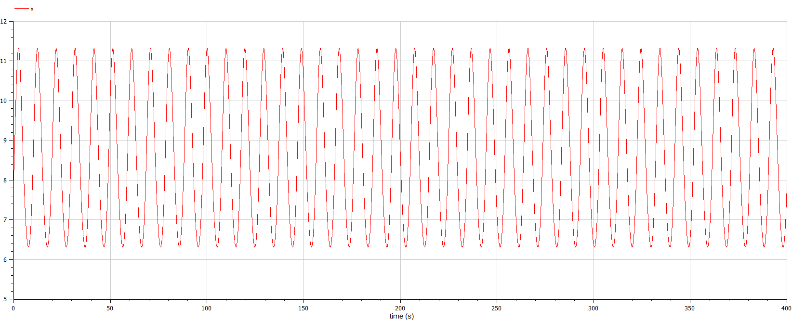
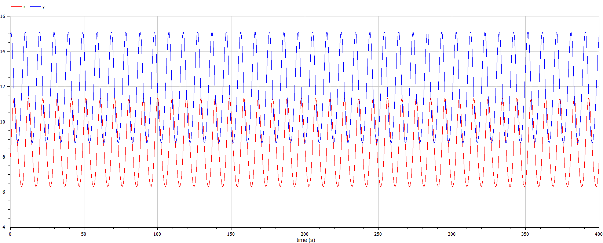
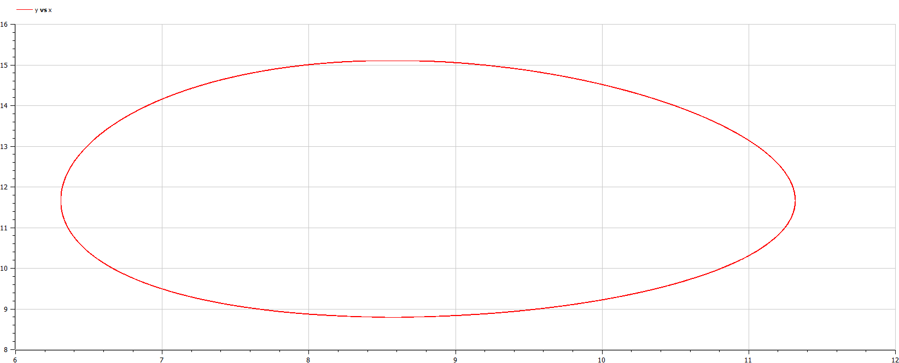

---
## Front matter
lang: ru-RU
title: Модель хищник-жертва
author: |
	 Миша Нкого Хосе Адольфо Мба НФИбд-02-19\inst{1}

institute: |
	\inst{1}Российский Университет Дружбы Народов

date: 8 марта, 2022, Москва, Россия

## Formatting
mainfont: PT Serif
romanfont: PT Serif
sansfont: PT Sans
monofont: PT Mono
toc: false
slide_level: 2
theme: metropolis
header-includes: 
 - \metroset{progressbar=frametitle,sectionpage=progressbar,numbering=fraction}
 - '\makeatletter'
 - '\beamer@ignorenonframefalse'
 - '\makeatother'
aspectratio: 43
section-titles: true

---

# Цели и задачи работы

## Цель лабораторной работы

Изучить простейшую модель Лотки-Вольтерры хищник-жертва, основанную на нескольких предлоположениях. 
Построить модель с помощью дифференциальных уравнений. Сделать выводы по заданию

## Задание к лабораторной работе

1.	Построить график зависимости $x$ от $y$ и графики функций $x(t)$, $y(t)$
2.	Найти стационарное состояние системы

# Процесс выполнения лабораторной работы

## Теоретический материал 
В данной лабораторной работе рассматривается математическая модель системы «Хищник-жертва». 

* Рассмотрим базисные компоненты системы: $X$ хищников и $Y$ жертв.  
* Пусть для этой системы выполняются следующие предположения:
1.	Численность популяции жертв и хищников зависят только от времени (модель не учитывает пространственное распределение популяции на занимаемой территории)
2.	В отсутствии взаимодействия численность видов изменяется по модели Мальтуса, при этом число жертв увеличивается, а число хищников падает
3.	Естественная смертность жертвы и естественная рождаемость хищника считаются несущественными 
4.	Эффект насыщения численности обеих популяций не учитывается 
5.	Скорость роста численности жертв уменьшается пропорционально численности хищников

# Теоретический материал 

## Мой вариант: 
$$
 \begin{cases}
	\frac{dx}{dt} = -ax(t) + by(t)x(t)
	\\   
	\frac{dy}{dt} = cy(t) - dy(t)x(t)
 \end{cases}
$$

Стационарное состояние системы определяется следующим образом: 
$$
	x_0=\frac{a}{b}, y_0=\frac{c}{d}
$$

## Условие задачи

$$
 \begin{cases}
	\frac{dx}{dt} = -0.7x(t) + 0.06y(t)x(t)
	\\   
	\frac{dy}{dt} = 0.6y(t) - 0.07y(t)x(t)
 \end{cases}
$$

Постройте график зависимости численности хищников от численности жертв, а также графики изменения численности хищников и численности жертв 
при следующих начальных условиях: $x_0=8, y_0=15$
Найдите стационарное состояние системы

# Результаты работы: 

## График изменения численности хищников

{ #fig:001 width=70% height=70% }

## График изменения численности жертв

{ #fig:002 width=70% height=70% }

## Графики изменения численности жертв и хищников

{ #fig:003 width=70% height=70% }

## График зависимости численности хищников от численности жертв

{ #fig:004 width=70% height=70% }

Стационарное состояние $x_0=\frac{a}{b}=11.667, y_0=\frac{c}{d}=8.571$

# Выводы по проделанной работе

## Вывод

В ходе выполнения лабораторной работы была изучена модель хищник-жертва и построены графики зависимости количества хищников и жертв в разных отношениях и в разные периоды времени. 